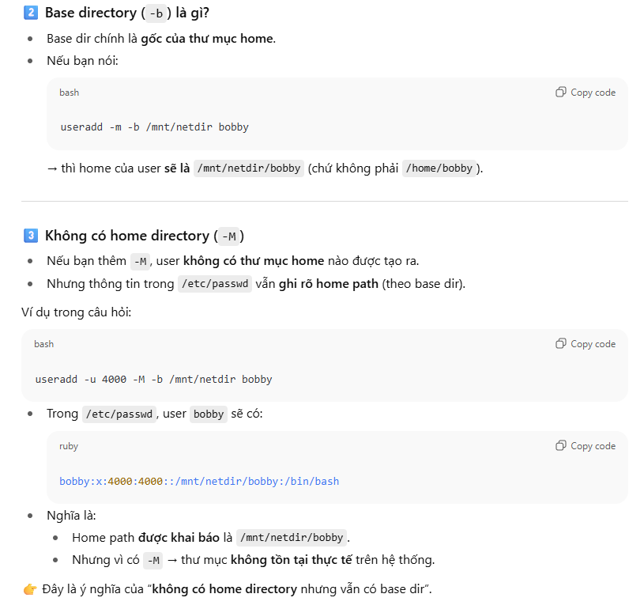

# Task 1: Resize devlops_lv and Configure Swap volume

On node1, resize the existing cloud_lv logical volume to 250MB (a size between 225-270MB is acceptable), while resizing its filesystem accordingly.

```bash
[root@redhat9-server-1 ~]# lvs
  LV        VG        Attr       LSize   Pool Origin Data%  Meta%  Move Log Cpy%Sync Convert
  cloud_lv  cloud_vg  -wi-a----- 200.00m                                                    
  devops_lv devops_vg -wi-ao----  40.00m                                                    
  root      rhel      -wi-ao---- <21.40g                                                    
  swap      rhel      -wi-ao----   2.01g                                                    
[root@redhat9-server-1 ~]# lvextend -L +50MiB /dev/cloud_vg/cloud_lv 
  Rounding size to boundary between physical extents: 52.00 MiB.
  Size of logical volume cloud_vg/cloud_lv changed from 200.00 MiB (50 extents) to 252.00 MiB (63 extents).
  Logical volume cloud_vg/cloud_lv successfully resized.
[root@redhat9-server-1 ~]# lvs
  LV        VG        Attr       LSize   Pool Origin Data%  Meta%  Move Log Cpy%Sync Convert
  cloud_lv  cloud_vg  -wi-a----- 252.00m                                                    
  devops_lv devops_vg -wi-ao----  40.00m                                                    
  root      rhel      -wi-ao---- <21.40g                                                    
  swap      rhel      -wi-ao----   2.01g 
```

Note
1. Dùng -L +50M
lvextend -L +50M /dev/<vg>/<lv>


👉 Nghĩa là tăng thêm 50 MiB so với dung lượng hiện tại (200 MiB → 250 MiB).

2. Dùng -L 250M
lvextend -L 250M /dev/<vg>/<lv>


👉 Nghĩa là đặt dung lượng mới chính xác là 250 MiB.

---
# Task 2: Configure Autofs for remote user home directories

Create a user named bobby with UID of 4000, with no home directory, and a base directory of /mnt/netdir and a password of hoppy.

```bash
[root@redhat9-server-1 ~]# useradd -u 4000 -M -b[root@redhat9-server-1 ~]# getent group bobby
bobby:x:4000:
[root@redhat9-server-1 ~]# tail /etc/passwd
bobby:x:4000:4000::/mnt/netdir/bobby:/bin/bash /mnt/netdir bobby
[root@redhat9-server-1 ~]# id bobby 
uid=4000(bobby) gid=4000(bobby) groups=4000(bobby)
[root@redhat9-server-1 ~]# echo hoppy | passwd --stdin bobby 
Changing password for user bobby.
passwd: all authentication tokens updated successfully.
[root@redhat9-server-1 ~]# su - bobby 
su: warning: cannot change directory to /mnt/netdir/bobby: No such file or directory
[bobby@redhat9-server-1 root]$ pwd
/root
[bobby@redhat9-server-1 root]$ 
```
Note:



Configure NFS autofs such that the home directory of user bob is automatically mounted at /mnt/netdir/bobby on login.

Note that bobby's account has been configured on the NFS server exporting their home directory at repo.rhcsa.home:/home/bobby.

Login as user bobby to verify your config.

Tren client NFS

```bash

[root@servera ~]# dnf install autofs -y

[root@redhat9-server-1 ~]# cd /etc/auto.master.d/

vi rhcsa.home
<
* -rw repo.rhcsa.home:/home/&
>

vi /etc/auto.master
<
+auto.master
/etc/auto.master.d/rhcsa.home
>

systemctl restart autofs
systemctl status autofs
systemctl enable autofs

```
```bash
su - bobby
->error
dnf install nfs-utils -y
systemctl status nfs-server
systemctl enable nfs-server
systemctl restart autofs

[root@node1 auto.master.d]# showmount -e repo.rhcsa.home
Export list for repo.rhcsa.home:
/home/bobby 192.168.70.0/24
/unite 192.168.70.0/24

```

Note:


