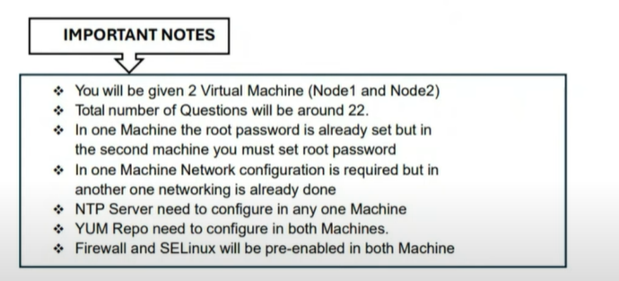

Node1 Questions:

# 1. Configure a static IP with the following details:
- IP: 192.168.76.20
- Gateway: 192.168.76.2
- DNS: 192.168.76.2
- Domain Name: Machine1.example.com
- Make sure networking starts automatically on boot.

Thêm search domain (domain name)  
```bash
nmcli con mod ens160 ipv4.dns-search "lab.example.com"
```
---

# 2. Configure the Yum Repo using given links.

http://content.example.com/rhel9.0/x86_64/rhcsa-practice/rht

http://content.example.com/rhel9.0/x86_64/rhcsa-practice/rht

```bash
vi /etc/yum.repos.d/local.repo
[BaseOS]
name=BaseOS
baseurl=http://content.example.com/rhel9.0/x86_64/rhcsa-practice/rht
gpgcheck=0
enabled=1

[AppStream]
name=Appstream
baseurl=http://content.example.com/rhe19.0/x86_64/rhcsa-practice/rht
gpgcheck=0
enabled=1

dnf clean all
dnf repolist
dnf install httpd
```
---
# 3. Create a directory/share/dev.
- Give ownership to devuser:devteam.
- Set permission so that members of devteam can read, write, and execute inside /share/dev.
- Use ACL to allow user john to have read-only access.
```bash
useradd devuser
id devuser
groupadd devteam
mkdir -p /share/dev
chown -R devuser:devteam /share/dev
chmod g+rwx /share/dev

ls -ld /share/dev
```
---
# 4. Create a user called Redhat.
- Set the password to Redhat@123
- Create a group called IT-Team and add Redhat user to this group.

```bash
echo Redhat@123 | passwd --stdin Redhat
groupadd IT-Team
usermod -aG IT-Team Redhat
id Redhat
```
---
# 5. Configure passwordless SSH login with node2 as the `natasha` user.
- Use ssh-keygen and ssh-copy-id.
- Test connectivity to ensure it works.

```bash
ssh-keygen
ssh-copy-id natasha@192.168.76.129
ssh natasha@192.168.76.129

```
---
# 6. A web server running on non-standard port 82 is having issues serving content,

Debug and fix the issues.
- The web server on your system can serve all the existing HTML files from
- /var/www/html
- Web service should automatically start at boot time.
```bash
curl 192.168.76.20:82
-> port 82: Connection refused
dnf install httpd -y
systemctl enable httpd
systemctl start httpd
systemctl status httpd
firewall-cmd --permanent --add-port=82/tcp
firewall-cmd --permanent --add-service=http
firewall-cmd --reload

semanage port -a -t http_port_t -p tcp 82

vi /etc/httpd/conf/httpd.conf
Listen 82
systemctl restart httpd
curl 192.168.76.20:82
```
---
# 7. Create a logical volume `lvdata` of size 500MB and volume group `vgdata` using `/dev/nvme0n2`.
- Format it with xfs, mount it permanently at /mnt/data.
```bash
parted /dev/nvme0n2 print
parted /dev/nvme0n2 mklabel gpt
parted /dev/nvme0n2 mkpart primary 1M 700M
parted /dev/nvme0n2 set 2 lvm on

pvcreate /dev/nvme0n2p1
vgcreate vgdata /dev/nvme0n2p1
vgs
lvcreate -L 500M -n lvdata vgdata
lvs
mkfs.xfs /dev/vgdata/lvdata
lsblk -f
mkdir /mnt/data
lsblk --fs (-> copy UUID /dev/vgdata/lvdata)
vi /etc/fstab
UUID=.... /mnt/data xfs defaults 0 0
mount -a 
systemctl daemon-reload
mount -a
df -hT
lsblk
```

---
# 8. Create a cron job for user `devuser` that runs the command uptime every 5 minutes and saves output to `/home/devuser/uptime.log`.
```bash

dnf install cronie -y

crontab -u devuser -e 
*/5 * * * * uptime >> /home/devuser/uptime.log
crontab -l -u devuser
```
---
# 9. Compress the directory `/etc` using tar with gzip and save it as `/root/etc_backup.tar.gz`.

```bash
tar -czvf /root/etc_backup.tar.gz /etc

ls 
file etc_backup.tar.gz
-> gzip 

# bzip
tar -cjvf /root/etc_backup.tar.bz2 /etc
tar --bzip2 -cvf /root/etc_backup.tar.bz2 /etc
# xz
tar --xz -cvf /root/etc_backup.tar.xz /etc


```

---
# 10. Create user `alex` and make alex user secondary group of group IT-Team.
```bash
useradd -G IT-Team alex
id alex

```

---
# 11. Create user
- john
- uid 2245
- set the user password redhat@321

```bash
useradd -u 2245 john
id john 
echo redhat@321 | passwd --stdin john
```

---
# 12. Locate all files owned by user `tom` and copy it under `/root/tomfiles`
```bash

mkdir /root/tomfiles
find / -type f -user tom -exec cp -pv {} /root/tomfiles \;


```
Note:
Ý nghĩa các option của cp:
- -p → preserve (giữ nguyên quyền, owner, timestamp của file gốc).
- -v → verbose (hiển thị chi tiết quá trình copy).
- -f: force, ghi đè nếu đã có file trùng tên (tùy yêu cầu, không bắt buộc).

Bonus
```bash
find <path> -type <f/d> -perm <mode>

find / -type f -perm 644 -exec cp {} /root/tomfiles \;
```

---
# 13. Locate all files and directories owned by user `jerry` and copy it under `/root/jerryfiles`

```bash
mkdir -p /root/jerryfiles
find / -user jerry -exec cp -prv {} /root/jerryfiles/ \;

```

---
# 14. Create a directory `/shared/projects`
- file ownership should go to user `alex`
- ensure no users can delete owner files inside /shared/projects other then file owner
```bash
mkdir -p /shared/projects
chown -R alex /shared/projects
ls -ld /shared/projects
chmod /shared/projects
chmod o+t /shared/projects

ls -ld /shared/projects
drwxr-xr-t. 2 alex alex 4096 Sep  5 20:20 /shared/projects
```
Note: Không user nào được phép xóa file của người khác, chỉ owner của file mới được xóa.

---
# 15. Create a script file with the name `script.sh` inside the `/bin` and locate all files from `/usr/local` directory which has more than 3k and less than 5k and copy under `/root/d1`.

Also set the sgid permission for this directory.
```bash

vi /bin/script.sh
#!/bin/bash
mkdir /root/d1
find /usr/local -size +3k -size -5k -exec cp -rpvf {} /root/d1 \;
chmod g+s /root/d1

chmod +x /bin/script.sh
sh script.sh
```

---
Node2 Questions:

# 16. Recover Root password, Password should be Redhat@321

(Note: Sometimes it doesn't specify any password so that case you can set any password)
```bash

e (0-rescue)
add "rd.break" (delete "console")
ctrl+X
mount -o rw,remount /sysroot
chroot /sysroot
echo redhat | passwd --stdin root
touch /.autorelabel
exit
```
---
# 17.Configure the Yum Repo using given links.

http://content.example.com/rhel9.0/x86 64/rhcsa-practice/rht

http://content.example.com/rhel9.0/x86 64/rhcsa-practice/rht


---
# 18. Create a container image using the given link

http://utility.example.com/container/Containerfile

- Named it "image32" I

- Login to 'registry.lab.example.com' through "admin" and "Admin@123"

- The container should be created with user "Sophia" (User will be already created, if not you should create that user)

(Note: Find Registry in Exam Instruction Page)
```
Practice Steps, After ssh with Shophia user

>podman login

(Login in podman with Redhat Account)

>vim Containerfile

Add below code and save

FROM registry.access.redhat.com/ubi9/ubi:latest

# Install Python 3

RUN dnf install -y python3

# Create required directories inside the container

RUN mkdir -p /opt/incoming/opt/outgoing

# Keep the container running

CMD ["/bin/bash", "-c", "sleep infinity"]

:wq!
```

```
Exam Steps, After ssh with Shophia user

>podman login registry.lab.example.com

Username: admin

Password: Admin@123

>wget http://utility.example.com/container/Containerfile

> podman build -t myimage -f Containerfile

```

Giai
```bash
dnd install podman container-tools -y
systemctl enable podman
systemctl start podman
systemctl status podman

ssh Shophia@192.168.76.129
podman login registry.lab.example.com

wget 
podman build -t image32 -f Containerfile
podman images
```

---
# 19. Create rootless container using the following conditions
- The container should be created with same regular user used in creating image.
- The service must be enabled so it could start automatically after reboot.
- The Container name is container24 should be created using previous image.
- Map the '/opt/files' to container '/opt/incoming'
- Map the '/opt/processed' to container '/opt/outgoing'
- Create systemd service as container-container24.service
- Make service active after all server reboots.

```bash
mkdir -p /opt/files
mkdir -p /opt/processed
chown -R Shophia:Shophia /opt/files
chown -R Shophia:Shophia /opt/processed
ssh Shophia@192.168.76.129

podman run -d  --name container24 -v /opt/files:/opt/incoming:Z -v /opt/outgoing:Z image32

podman ps 

loginctl enable-linger
loginctl show-user Shophia

mkdir -p /home/Shophia/.config/systemd/user

cd /home/Shophia/.config/systemd/user
podman generate systemd --new --files --name container24

systemctl --user daemon-reload
systemctl --user enable container-container24.service

systemctl --user stop container-container24.service

systemctl --user enable container-container24.service
-> root reboot ( for test )
```
---
# 20. Create a swap partition of 400MiB
- Do not modify current swap partition
- It should be persistent after reboot
```bash
lsblk

parted /dev/vdb mkpart swap2 linux-swap 2512M 3024M
udevadm settle

mkswap /dev/vdb2

vi /etc/fstab
UUID=87976166-4697-47b7-86d1-73a02f0fc803   swap    swap  pri=10    0 0
# UUID=87976166-4697-47b7-86d1-73a02f0fc803   swap    swap  defaults    0 0

swapon -a
lsblk
swapon --show

```
--- 
# 21. Create a logical volume called `LV1` under the volume group called VG1 with 16M extend and logical extend should be 30 extend.
- format the logical volume using ext4 file system
- mount it under /database

✅ Yêu cầu bài 21
- Tạo LV LV1 trong VG VG1.
- Mỗi extent (PE) của VG1 có size = 16M.
- LV cần có 30 extent.
- Tổng dung lượng LV = 16M × 30 = 480M.
- Format LV bằng ext4.
- Mount LV vào /database.

```bash
vgcreate -s 16M VG1 /dev/sdX
vgdisplay devops_vg 
lvcreate -n LV1 -l 30 VG1
# or  lvcreate -n LV1 -L 480M VG1 (30x16=480)
lvdisplay /dev/VG1/LV1
mkfs.ext4 /dev/VG1/LV1
mkdir -p /database

vi /etc/fstab
/dev/VG1/LV1   /database   ext4   defaults   0 0
mount -a

```
---
# 22.Configure recommended tuned profile
```bash
dnf install tuned
tuned-adm recommend
tuned-adm profile virtual-guest
tuned-adm active
tuned-adm profile 


```

---
BONUS EXAM TIPS:

1. Read the Instruction page properly (Spend 5-10 Minute)

2. Enable Each Service After Configuring. (use systemctl)

3. Do Easy Tasks First than Do Difficult Tasks.

4. Whenever Necessary Restart Machine To Check Your Configuration After Reboot

(Container, LVM, Autofs,)

5. verify your Configuraion after configuring the question

---
✅ BONUS EXAM TIPS – EX200
1. Đọc kỹ đề
- Dành 5–10 phút đầu để đọc toàn bộ đề, xem yêu cầu hệ thống (hostname, IP, users, dịch vụ…).
- Đề thường có nhiều câu nhỏ phụ thuộc nhau, nếu làm sai từ đầu thì kéo theo sau sẽ lỗi.

2. Dịch vụ (Services)
- Sau khi cấu hình xong bất kỳ service nào (httpd, nfs, samba, chrony, …):
```
systemctl enable <service>
systemctl start <service>
systemctl status <service>
```
- Nếu quên enable, sau reboot sẽ mất cấu hình → trừ điểm nặng.

3. Chiến lược làm bài
- Làm dễ trước (user/group, permission, cron, tar, find, file ACL…).
- Sau đó làm bài khó/tốn thời gian (LVM, NFS/Autofs, Firewall, SELinux, Container).
- Đừng sa đà quá lâu vào 1 bài → còn bài khác để ăn điểm.

4. Kiểm tra reboot
- Một số bài bắt buộc phải test reboot để đảm bảo cấu hình vẫn còn:
  - LVM mount với /etc/fstab.
  - Autofs.
  - Containers.
  - Firewall/NFS/SELinux.
- Nếu có thời gian, reboot ít nhất 1 lần trước khi nộp bài.

5. Verify (Xác minh)
- Sau khi làm xong mỗi task → test ngay:
- User/group → id, su, ls -l.
- Cron → crontab -l.
- NFS/Samba → mount, ls, touch.
- LVM → lvdisplay, df -h, mount.
- SELinux → getenforce, semanage fcontext, restorecon.
- Firewall → firewall-cmd --list-all.

6. Một số mẹo nhỏ khác
- Ghi chú ra giấy (được phát trong phòng thi) những service bạn đã làm xong.
- Copy/paste cẩn thận: đề có thể đánh lừa bằng hostname khác (servera vs serverA).
- Dùng man page nếu quên cú pháp (man lvcreate, man mount, man semanage).
- Không xóa nhầm dữ liệu gốc (ví dụ khi copy file của user).
- Đừng panic nếu lỡ làm sai, chỉ cần xóa rồi làm lại từ đầu.

📌 Tóm lại:

Đọc đề kỹ → làm dễ trước → enable + verify service → reboot test → kiểm tra lại trước khi nộp.