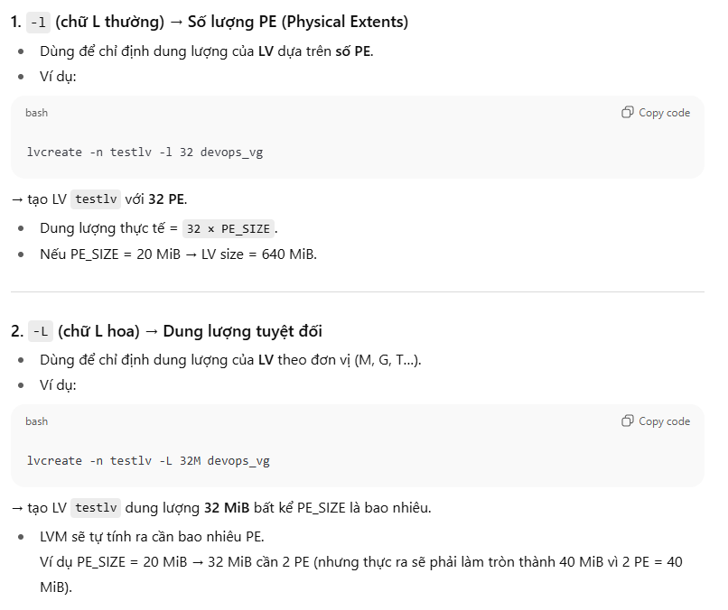

# Task 1: Set Up LVM on node1

Create a logical volume named devops_lv with 32 extents using the /dev/vdb disk.

This should be created from a volume group named devops_vg with 20MB physical extents.

Format the logical volume as an ext4 filesystem and mount it persistently at /mnt/devops_lv.

Check your work.

```bash
[root@redhat9-server-1 ~]# echo $((32*20))
640
[root@redhat9-server-1 ~]# echo $((32+20))
52
```

```bash
[root@redhat9-server-1 ~]#  parted /dev/nvme0n2 mkpart primary xfs 1MiB 513MiB
Information: You may need to update /etc/fstab.

[root@redhat9-server-1 ~]#  parted /dev/nvme0n2 unit MiB print
Model: VMware Virtual NVMe Disk (nvme)
Disk /dev/nvme0n2: 10240MiB
Sector size (logical/physical): 512B/512B
Partition Table: gpt
Disk Flags: 

Number  Start    End     Size    File system  Name     Flags
 1      1.00MiB  513MiB  512MiB  xfs          primary

[root@redhat9-server-1 ~]# lsblk 
NAME          MAJ:MIN RM  SIZE RO TYPE MOUNTPOINTS
sr0            11:0    1 11.9G  0 rom  
nvme0n1       259:0    0   25G  0 disk 
├─nvme0n1p1   259:1    0  600M  0 part /boot/efi
├─nvme0n1p2   259:2    0    1G  0 part /boot
└─nvme0n1p3   259:3    0 23.4G  0 part 
  ├─rhel-root 253:0    0 21.4G  0 lvm  /
  └─rhel-swap 253:1    0    2G  0 lvm  [SWAP]
nvme0n2       259:4    0   10G  0 disk 
└─nvme0n2p1   259:6    0  512M  0 part 
nvme0n3       259:5    0   10G  0 disk 
[root@redhat9-server-1 ~]# pvcreate /dev/nvme0n2p1 
WARNING: xfs signature detected on /dev/nvme0n2p1 at offset 0. Wipe it? [y/n]: y    
  Wiping xfs signature on /dev/nvme0n2p1.
  WARNING: adding device /dev/nvme0n2p1 with idname eui.1d95491d54120608000c2968a0e6ad34 which is already used for missing device.
  Physical volume "/dev/nvme0n2p1" successfully created.
[root@redhat9-server-1 ~]# man pvcreate
[root@redhat9-server-1 ~]# man vgcreate (/EXAMPLE)

```
Note:   
📌 Tại sao có cảnh báo?
- Khi bạn chạy pvcreate /dev/nvme0n2p1, bạn muốn biến phân vùng này thành Physical Volume (PV) để dùng cho LVM.
- Nhưng hệ thống phát hiện trên /dev/nvme0n2p1 đang có dấu vết (signature) của XFS filesystem (nghĩa là phân vùng này trước đó đã được format làm XFS).
- Nếu bạn ghi đè (wipe) thì dữ liệu cũ sẽ mất, và phân vùng này sẽ trở thành PV sạch để dùng cho LVM.

```bash
[root@redhat9-server-1 ~]# vgcreate -s 20M devops_vg /dev/nvme0n2p1 
[root@redhat9-server-1 ~]# vgdisplay devops_vg 
  --- Volume group ---
  VG Name               devops_vg
  System ID             
  Format                lvm2
  Metadata Areas        1
  Metadata Sequence No  1
  VG Access             read/write
  VG Status             resizable
  MAX LV                0
  Cur LV                0
  Open LV               0
  Max PV                0
  Cur PV                1
  Act PV                1
  VG Size               500.00 MiB
  PE Size               20.00 MiB
  Total PE              25
  Alloc PE / Size       0 / 0   
  Free  PE / Size       25 / 500.00 MiB
  VG UUID               UF1qfl-Xvt4-wqpA-Lvo3-1zgp-iw03-TM90vK
```
Vì sao bạn tạo 512 MiB partition nhưng VG chỉ có 500 MiB?
- Phân vùng /dev/nvme0n2p1 của bạn có 512 MiB.
- Khi bạn chạy pvcreate /dev/nvme0n2p1, LVM sẽ đặt metadata ở đầu và/hoặc cuối PV để lưu thông tin (VG name, UUID, PE size, …).
- Metadata này chiếm một phần dung lượng (~12 MiB trong trường hợp của bạn).
- Vì vậy dung lượng usable cho VG nhỏ hơn tổng partition.

Kết quả:
```
Partition size  : 512 MiB
Usable for VG   : ~500 MiB
Metadata        : ~12 MiB

[root@redhat9-server-1 ~]# pvdisplay /dev/nvme0n2p1 
  --- Physical volume ---
  PV Name               /dev/nvme0n2p1
  VG Name               devops_vg
  PV Size               512.00 MiB / not usable 12.00 MiB
  Allocatable           yes 
  PE Size               20.00 MiB
  Total PE              25
  Free PE               25
  Allocated PE          0
  PV UUID               LTN9LS-eDmd-FRog-Q7wA-MV7m-yG1D-uyNgvK
```


Cong thuc:
```
Total PE = VG Size / PE Size 
```

```
[root@redhat9-server-1 ~]# vgdisplay devops_vg 
  --- Volume group ---
  VG Name               devops_vg
  System ID             
  Format                lvm2
  Metadata Areas        2
  Metadata Sequence No  2
  VG Access             read/write
  VG Status             resizable
  MAX LV                0
  Cur LV                0
  Open LV               0
  Max PV                0
  Cur PV                2
  Act PV                2
  VG Size               640.00 MiB
  PE Size               20.00 MiB
  Total PE              32
  Alloc PE / Size       0 / 0   
  Free  PE / Size       32 / 640.00 MiB
  VG UUID               UF1qfl-Xvt4-wqpA-Lvo3-1zgp-iw03-TM90vK
```
Tao LV
```
[root@redhat9-server-1 ~]# lvcreate -n devops_lv -l 2 devops_vg
  Logical volume "devops_lv" created.

[root@redhat9-server-1 ~]# vgdisplay devops_vg 
  --- Volume group ---
  VG Name               devops_vg
  System ID             
  Format                lvm2
  Metadata Areas        2
  Metadata Sequence No  2
  VG Access             read/write
  VG Status             resizable
  MAX LV                0
  Cur LV                0
  Open LV               0
  Max PV                0
  Cur PV                2
  Act PV                2
  VG Size               640.00 MiB
  PE Size               20.00 MiB
  Total PE              32
  Alloc PE / Size       0 / 0   
  Free  PE / Size       32 / 640.00 MiB
  VG UUID               UF1qfl-Xvt4-wqpA-Lvo3-1zgp-iw03-TM90vK

[root@redhat9-server-1 ~]# lvdisplay /dev/devops_vg/devops_lv
  --- Logical volume ---
  LV Path                /dev/devops_vg/devops_lv
  LV Name                devops_lv
  VG Name                devops_vg
  LV UUID                jKPd6d-sQfC-AHA9-8MHp-HZYz-1axE-hDaSvm
  LV Write Access        read/write
  LV Creation host, time redhat9-server-1, 2025-09-01 15:21:56 +0700
  LV Status              available
  # open                 0
  LV Size                40.00 MiB
  Current LE             2
  Segments               1
  Allocation             inherit
  Read ahead sectors     auto
  - currently set to     256
  Block device           253:2
```


Note:


Format
```bash
[root@redhat9-server-1 ~]# mkfs.ext4 /dev/devops_vg/devops_lv 
mke2fs 1.46.5 (30-Dec-2021)
Creating filesystem with 40960 1k blocks and 10240 inodes
Filesystem UUID: bb8da5ac-c377-4f23-98a5-591c3b9f08f5
Superblock backups stored on blocks: 
	8193, 24577

Allocating group tables: done                            
Writing inode tables: done                            
Creating journal (4096 blocks): done
Writing superblocks and filesystem accounting information: done

[root@redhat9-server-1 ~]# lsblk -f
NAME                    FSTYPE      FSVER            LABEL                    UUID                                   FSAVAIL FSUSE% MOUNTPOINTS
sr0                     iso9660     Joliet Extension RHEL-9-6-0-BaseOS-x86_64 2025-04-08-23-13-43-00                                
nvme0n1                                                                                                                             
├─nvme0n1p1             vfat        FAT32                                     0129-BCEF                               591.8M     1% /boot/efi
├─nvme0n1p2             xfs                                                   6fbead99-fd4c-4a8d-bfc6-b893e14a8884    603.7M    37% /boot
└─nvme0n1p3             LVM2_member LVM2 001                                  nqbb41-8oix-G8dL-0KbO-nTR3-8Be8-YfenmI                
  ├─rhel-root           xfs                                                   131d0080-1a1b-4e25-be6b-dded50e4a185     15.1G    29% /
  └─rhel-swap           swap        1                                         817eccd6-3dcd-4fd0-b555-6ce24454d72a                  [SWAP]
nvme0n2                                                                                                                             
├─nvme0n2p1             LVM2_member LVM2 001                                  LTN9LS-eDmd-FRog-Q7wA-MV7m-yG1D-uyNgvK                
│ └─devops_vg-devops_lv ext4        1.0                                       bb8da5ac-c377-4f23-98a5-591c3b9f08f5                  
└─nvme0n2p2             LVM2_member LVM2 001                                  SB6lYy-07lM-KL6e-OfQ8-OEfo-15T4-ApaHoM                
nvme0n3                                                                                                                             
[root@redhat9-server-1 ~]# 
```

Mount direction
```bash
[root@redhat9-server-1 ~]# mkdir /mnt/devops_lv
[root@redhat9-server-1 ~]# vi /etc/fstab
<
UUID=bb8da5ac-c377-4f23-98a5-591c3b9f08f5 /mnt/devops_lv ext4 defaults 0 0 
> 
[root@redhat9-server-1 ~]# mount -a
mount: (hint) your fstab has been modified, but systemd still uses
       the old version; use 'systemctl daemon-reload' to reload.

[root@redhat9-server-1 ~]# df -hT
/dev/mapper/devops_vg-devops_lv ext4       33M   14K   30M   1% /mnt/devops_lv

```

---

# Task 2: Create and Mount Swap volume persistently

From /dev/vdb, create a 800MB swap partition and configure it to mount persistently.

All your changes must persist after a reboot.

Tao phan vung lam swap
```bash
[root@redhat9-server-1 ~]# parted /dev/nvme0n2 unit MiB print
Model: VMware Virtual NVMe Disk (nvme)
Disk /dev/nvme0n2: 10240MiB
Sector size (logical/physical): 512B/512B
Partition Table: gpt
Disk Flags: 

Number  Start    End     Size    File system  Name     Flags
 1      1.00MiB  513MiB  512MiB               primary
 2      513MiB   666MiB  153MiB               primary

[root@redhat9-server-1 ~]# free -h
               total        used        free      shared  buff/cache   available
Mem:           1.7Gi       929Mi       305Mi       7.0Mi       666Mi       809Mi
Swap:          2.0Gi          0B       2.0Gi

[root@redhat9-server-1 ~]# parted /dev/nvme0n2 mkpart swap1 linux-swap 666MiB 1466MiB
Information: You may need to update /etc/fstab.
[root@redhat9-server-1 ~]# parted /dev/nvme0n2 unit MiB print
Model: VMware Virtual NVMe Disk (nvme)
Disk /dev/nvme0n2: 10240MiB
Sector size (logical/physical): 512B/512B
Partition Table: gpt
Disk Flags: 

Number  Start    End      Size    File system  Name     Flags
 1      1.00MiB  513MiB   512MiB               primary
 2      513MiB   666MiB   153MiB               primary
 3      666MiB   1466MiB  800MiB               swap1    swap

[root@redhat9-server-1 ~]# mkswap /dev/nvme0n2p3 
Setting up swapspace version 1, size = 800 MiB (838856704 bytes)
no label, UUID=0e773dc4-db28-449e-8a37-9f736af475e8

[root@redhat9-server-1 ~]# parted /dev/nvme0n2 unit MiB print
Model: VMware Virtual NVMe Disk (nvme)
Disk /dev/nvme0n2: 10240MiB
Sector size (logical/physical): 512B/512B
Partition Table: gpt
Disk Flags: 

Number  Start    End      Size    File system     Name     Flags
 1      1.00MiB  513MiB   512MiB                  primary
 2      513MiB   666MiB   153MiB                  primary
 3      666MiB   1466MiB  800MiB  linux-swap(v1)  swap1    swap

[root@redhat9-server-1 ~]# vi  /etc/fstab
UUID=0e773dc4-db28-449e-8a37-9f736af475e8 swap swap defaults 0 0

```
Bat swap
```bash
[root@redhat9-server-1 ~]# mount -a
[root@redhat9-server-1 ~]# swapon -a
[root@redhat9-server-1 ~]# swapon
NAME           TYPE      SIZE USED PRIO
/dev/dm-1      partition   2G   0B   -2
/dev/nvme0n2p3 partition 800M   0B   -3
[root@redhat9-server-1 ~]# free -h
               total        used        free      shared  buff/cache   available
Mem:           1.7Gi       916Mi       317Mi       7.0Mi       666Mi       821Mi
Swap:          2.8Gi          0B       2.8Gi

[root@redhat9-server-1 ~]# lsblk 
NAME                    MAJ:MIN RM  SIZE RO TYPE MOUNTPOINTS
sr0                      11:0    1 11.9G  0 rom  
nvme0n1                 259:0    0   25G  0 disk 
├─nvme0n1p1             259:1    0  600M  0 part /boot/efi
├─nvme0n1p2             259:2    0    1G  0 part /boot
└─nvme0n1p3             259:3    0 23.4G  0 part 
  ├─rhel-root           253:0    0 21.4G  0 lvm  /
  └─rhel-swap           253:1    0    2G  0 lvm  [SWAP]
nvme0n2                 259:4    0   10G  0 disk 
├─nvme0n2p1             259:5    0  512M  0 part 
│ └─devops_vg-devops_lv 253:2    0   40M  0 lvm  /mnt/devops_lv
├─nvme0n2p2             259:6    0  153M  0 part 
└─nvme0n2p3             259:8    0  800M  0 part [SWAP]
nvme0n3                 259:7    0   10G  0 disk 

```